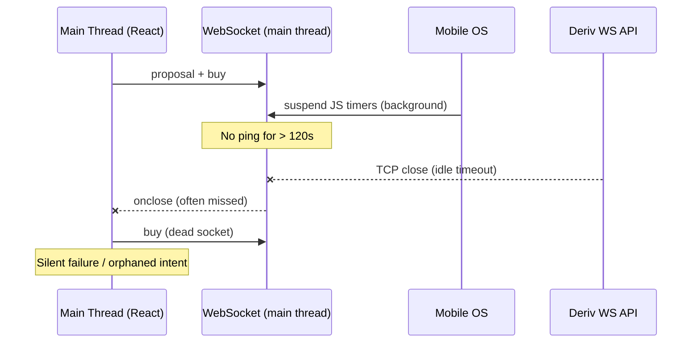
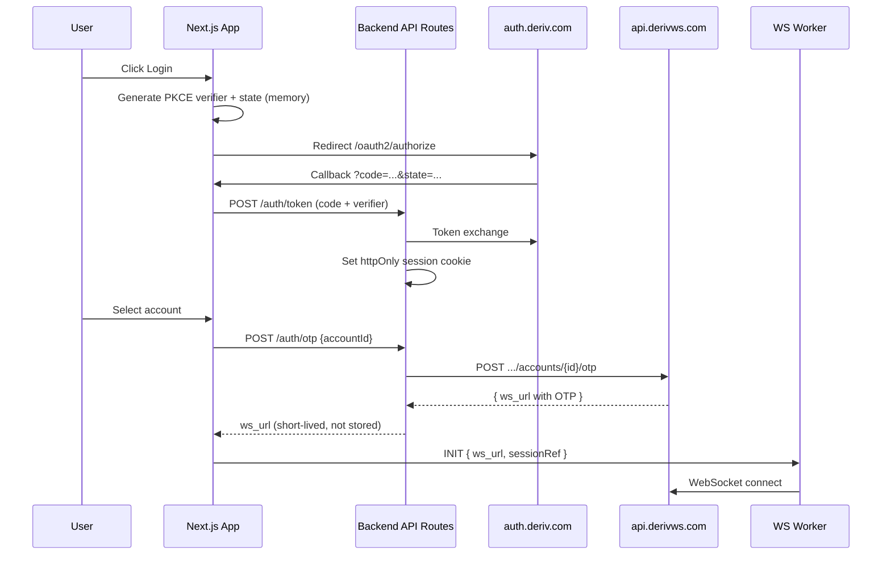
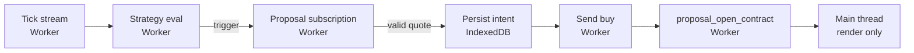
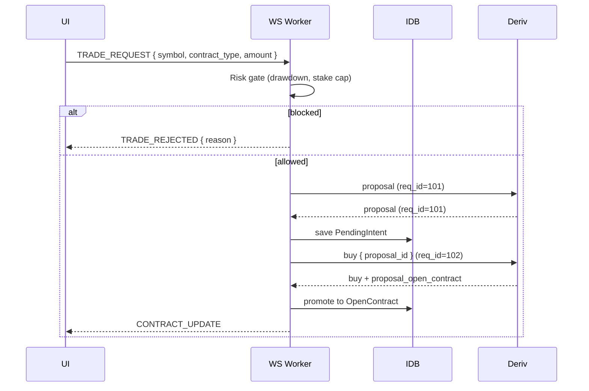
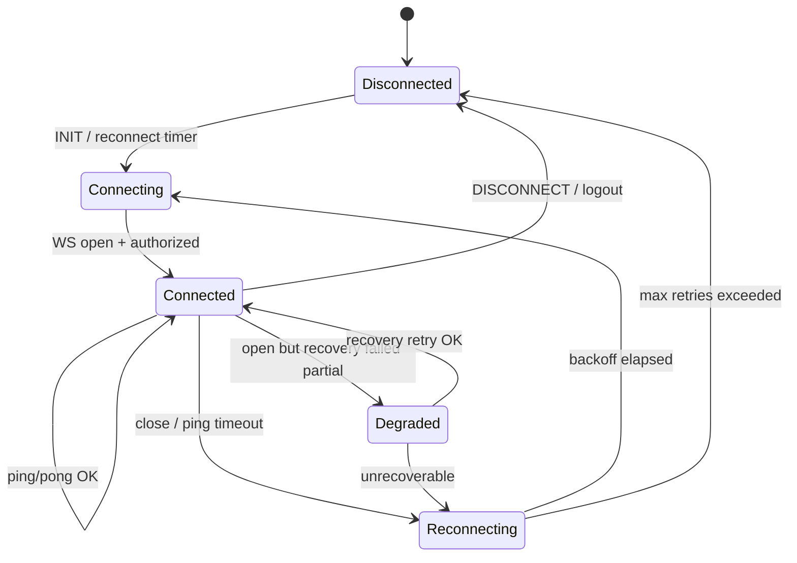
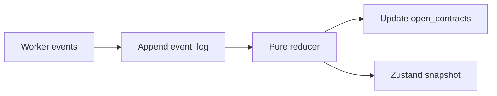
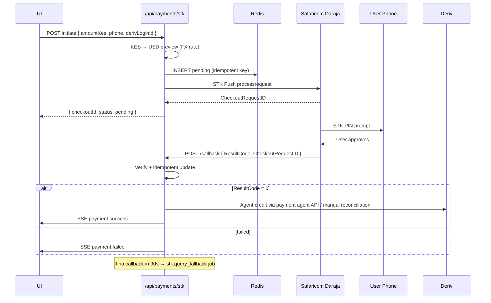
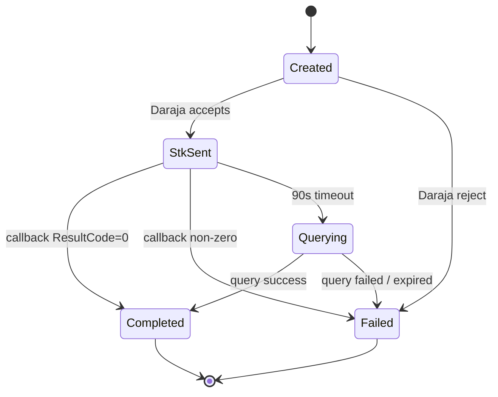

# Technical Architecture Specification

## East Africa Deriv 3rd-Party Trading Platform

**Document version:** 0.6 (Phase E — pre-launch hardening)  
**Companion doc:** `PRD.md`  
**Status:** Phase D complete; Phase E code items shipped — infra/OAuth remain external

---

## Table of Contents

1. [Design Principles](#1-design-principles)
2. [Phase 2 — Failure Analysis & Root Causes](#2-phase-2--failure-analysis--root-causes)
3. [End-to-End System Architecture](#3-end-to-end-system-architecture)
4. [Component Specifications](#4-component-specifications)
5. [Resilient WebSocket Engine (Design)](#5-resilient-websocket-engine-design)
6. [State Management & Offline Recovery](#6-state-management--offline-recovery)
7. [M-Pesa & Mobile Money Integration](#7-m-pesa--mobile-money-integration)
8. [Security Architecture](#8-security-architecture)
9. [Execution Pipeline & Latency Budget](#9-execution-pipeline--latency-budget)
10. [Implementation Phases (Step-by-Step)](#10-implementation-phases-step-by-step)
11. [Technology Stack](#11-technology-stack)
12. [Testing & Chaos Strategy](#12-testing--chaos-strategy)

---

## 1. Design Principles

| Principle | Rationale |
| --- | --- |
| **Worker-isolated I/O** | Mobile browsers throttle main-thread timers and suspend tabs; WS must live in a Dedicated Worker |
| **Server holds secrets** | OAuth tokens and OTP generation never touch `localStorage` |
| **Idempotent money** | Every STK Push maps to exactly one ledger entry (CheckoutRequestID as idempotency key) |
| **Fail closed on auth** | Degraded WS → block new `buy`; allow read-only portfolio |
| **Event-sourced trading state** | Append-only event log → rebuild UI state after crash |
| **Correlation everywhere** | Every WS request carries monotonic `req_id`; responses matched before side effects |

---

## 2. Phase 2 — Failure Analysis & Root Causes

### 2.1 Network & Protocol Flaws

#### Symptom
WebSocket disconnects when the mobile screen locks, the user switches cell towers, or the browser tab is backgrounded. Open contracts appear "stuck"; new trades fail silently.

#### Root causes



| # | Root cause | Mechanism |
| --- | --- | --- |
| N-1 | **Idle timeout** | Deriv closes connections after ~2 minutes without traffic ([keep-alive docs](https://developers.deriv.com/docs/keep-connection-live)). Background tabs stop `setInterval` ping. |
| N-2 | **Main-thread coupling** | React re-renders block WS `onmessage` processing; proposal responses queue behind UI work. |
| N-3 | **No reconnect FSM** | Typical apps create a new socket but fail to re-`authorize`, re-subscribe ticks, and reconcile open contracts. |
| N-4 | **TCP handoff on tower switch** | 3G/4G IP change kills TCP without clean WS close frame; client sees `1006` abnormal closure. |
| N-5 | **Orphaned trade intents** | `proposal` succeeded, `buy` never sent; no persistent "pending intent" record survives reload. |

#### Architectural fix (summary)
Dedicated Worker owns socket lifecycle; exponential backoff reconnect; on reconnect run **Recovery Sequence** (§5.4); persist pending intents to IndexedDB before `buy`.

---

### 2.2 Security & Auth Vulnerabilities

#### Symptom
Community apps and DBot forks store `authorize` tokens or API keys in `localStorage` / sessionStorage. XSS or shared-device access → account takeover.

| # | Pattern | Risk | Severity |
| --- | --- | --- | --- |
| S-1 | Raw API token in client storage | Full account access if exfiltrated | Critical |
| S-2 | OAuth token in JS-accessible cookie | Same as S-1 without httpOnly | Critical |
| S-3 | OTP in client-side routing state | Short-lived but loggable | High |
| S-4 | Payment agent apps requesting Deriv password | Phishing surface | Critical |
| S-5 | Telegram-distributed bots with embedded tokens | Supply-chain compromise | High |

#### Target auth flow



**Compliance notes:**
- PKCE `code_verifier` lives in memory or sessionStorage (cleared post-exchange) — never localStorage.
- Access token stored server-side (encrypted Redis session) — never sent to client as a long-lived string.
- Worker receives **ephemeral WS URL** only; re-fetched on reconnect via backend OTP endpoint.

---

### 2.3 Execution & Slippage Bottlenecks

#### Symptom
On Crash/Boom and Volatility 100, automated strategies miss entries; manual traders see stale prices.

| # | Bottleneck | Impact |
| --- | --- | --- |
| E-1 | Proposal and buy on main thread behind React reconciliation | +50–200 ms |
| E-2 | Re-request proposal on every tick instead of subscription | Rate limits + latency |
| E-3 | No in-flight guard (double buy on duplicate click) | Overexposure |
| E-4 | JSON parse on main thread for high-frequency tick streams | Jank → missed windows |
| E-5 | Sequential await: `proposal` then `buy` without pipelining warm proposals | 2× RTT |

#### Target pipeline



**Latency budget (client-side only, excl. RTT):** ≤ 15 ms from trigger to `buy` send.

---

### 2.4 State Resilience Failures

#### Symptom
Browser refresh mid-contract → UI shows empty portfolio until manual reload; bot thinks it's flat.

| # | Root cause | Fix |
| --- | --- | --- |
| R-1 | Ephemeral React state | Mirror contracts to IndexedDB on every `proposal_open_contract` update |
| R-2 | No hydration on mount | Boot sequence reads IndexedDB → reconciles with WS `portfolio` call |
| R-3 | Subscription IDs lost | Store `{ symbol, subscription_id }` map; replay on reconnect |
| R-4 | Clock skew on expiry | Use server `date_start` / `expiry_time` from API, not client clock |

---

## 3. End-to-End System Architecture

### 3.1 High-Level Diagram

```mermaid
flowchart TB
    subgraph Client["Browser (Chrome)"]
        UI[Next.js UI<br/>App Router + RSC/hydration]
        SW[Service Worker<br/>optional PWA shell]
        WW[Web Worker<br/>WS Engine]
        IDB[(IndexedDB<br/>contracts + intents)]
        LDB[(localStorage<br/>preferences only)]
        UI <-->|postMessage| WW
        UI <-->|read/write| IDB
        UI --> LDB
    end

    subgraph Backend["Next.js Server / Edge"]
        AUTH[/api/auth/*]
        OTP[/api/trading/otp]
        FX[/api/fx/rates]
        PAY[/api/payments/*]
        Q[Redis<br/>sessions + job queue]
        AUTH --> Q
        OTP --> Q
        PAY --> Q
    end

    subgraph External["External Services"]
        DERIV_WS[Deriv WebSocket API<br/>wss://api.derivws.com]
        DERIV_REST[Deriv REST API<br/>https://api.derivws.com]
        DARAJA[Safaricom Daraja<br/>STK Push]
        FXSRC[FX rate source<br/>CBK / open exchange]
    end

    WW <-->|WSS + JSON| DERIV_WS
    OTP --> DERIV_REST
    AUTH --> DERIV_REST
    PAY --> DARAJA
    FX --> FXSRC
    PAY --> DERIV_REST
```

### 3.2 Data Flow — Manual Trade (Happy Path)



### 3.3 Repository Layout (Planned)

```
deriv-platform/
├── app/                          # Next.js App Router
│   ├── (auth)/login/
│   ├── (trade)/dashboard/
│   ├── (wallet)/deposit/
│   └── api/
│       ├── auth/[...]/
│       ├── trading/otp/
│       ├── payments/stk/
│       ├── payments/callback/
│       └── fx/rates/
├── workers/
│   └── deriv-ws.engine.ts        # Dedicated Worker entry (Phase A)
├── lib/
│   ├── ws/                       # Protocol types, message schemas
│   ├── state/                    # Event reducers (pure functions)
│   ├── risk/                     # Drawdown, stake limits
│   ├── fx/                       # Display currency conversion
│   └── payments/                 # Ledger types
├── stores/                       # Zustand or similar (UI-only state)
└── docs/
    ├── ARCHITECTURE.md           # this file
    └── PRD.md
```

---

## 4. Component Specifications

### 4.1 Frontend Shell (Next.js)

| Responsibility | Detail |
| --- | --- |
| Rendering | Trade ticket, chart (lightweight), portfolio, connection banner |
| Auth UI | OAuth redirect initiation; never handles raw tokens |
| Worker bridge | Thin `useDerivConnection()` hook — postMessage only |
| Risk UI | Configure daily drawdown, session stop, max stake |

**Explicit non-responsibilities:** No direct WebSocket in React components.

### 4.2 Backend API Routes

| Route | Method | Purpose |
| --- | --- | --- |
| `/api/auth/login` | GET | Redirect to Deriv OAuth |
| `/api/auth/callback` | GET | Code exchange, set session |
| `/api/auth/logout` | POST | Clear session + notify Worker |
| `/api/trading/otp` | POST | Mint ephemeral WS URL for account |
| `/api/fx/rates` | GET | Cached KES/UGX/TZS/RWF rates |
| `/api/payments/stk/initiate` | POST | Create pending ledger row + STK Push |
| `/api/payments/stk/callback` | POST | Safaricom webhook (public, signed) |
| `/api/payments/stk/query` | POST | Poll fallback for pending STK |
| `/api/payments/ledger` | GET | User transaction history |

### 4.3 Redis Usage

| Key pattern | TTL | Content |
| --- | --- | --- |
| `session:{id}` | 24 h | OAuth access token (encrypted), loginid list |
| `otp:lock:{accountId}` | 30 s | Prevent OTP stampede on reconnect storm |
| `stk:pending:{checkoutId}` | 1 h | Payment state machine |
| `fx:KESUSD` | 60 s | Cached rate |

### 4.4 Job Queue (BullMQ or equivalent)

| Job | Trigger | Action |
| --- | --- | --- |
| `stk.query_fallback` | STK initiated + 90 s no callback | Daraja STK Query API |
| `balance.poll` | STK success | Deriv REST balance check → notify UI via SSE |
| `session.refresh` | Token near expiry | Refresh OAuth token server-side |

---

## 5. Resilient WebSocket Engine (Design)

> **Note:** TypeScript interfaces below are **design contracts** for Phase A implementation — not shipped code.

### 5.1 Worker Message Protocol

```typescript
// Design contract — workers/deriv-ws.engine.ts (Phase A)

type WorkerCommand =
  | { type: 'INIT'; payload: { wsUrl: string; appId: string } }
  | { type: 'DISCONNECT' }
  | { type: 'SUBSCRIBE_TICKS'; payload: { symbol: string } }
  | { type: 'UNSUBSCRIBE'; payload: { subscriptionId: string } }
  | { type: 'TRADE_REQUEST'; payload: TradeRequest }
  | { type: 'SELL'; payload: { contractId: number } }
  | { type: 'FORCE_RECONNECT' };

type WorkerEvent =
  | { type: 'CONNECTION_STATE'; payload: ConnectionState }
  | { type: 'TICK'; payload: TickEvent }
  | { type: 'PROPOSAL'; payload: ProposalEvent }
  | { type: 'CONTRACT_UPDATE'; payload: OpenContractEvent }
  | { type: 'TRADE_REJECTED'; payload: { reason: string } }
  | { type: 'ERROR'; payload: { code: string; message: string } }
  | { type: 'RECOVERY_COMPLETE'; payload: RecoverySnapshot };

type ConnectionState =
  | 'connecting'
  | 'connected'
  | 'reconnecting'
  | 'degraded'   // connected but recovery incomplete
  | 'disconnected';
```

### 5.2 Connection State Machine



### 5.3 Reconnect & Backoff Policy

| Parameter | Value | Notes |
| --- | --- | --- |
| Initial backoff | 500 ms | Immediate retry on 1006 often fails |
| Max backoff | 30 s | Cap to preserve battery |
| Jitter | ±20% | Prevent thundering herd |
| Max retries | ∞ (user session) | UI shows offline after 5 failures |
| Ping interval | 25 s | Under 30–60 s Deriv recommendation |
| Ping timeout | 10 s | Trigger reconnect if no pong |
| OTP refresh | Every reconnect | New WS URL from `/api/trading/otp` |

### 5.4 Recovery Sequence (Post-Reconnect)

Execute in order; abort new trades until step 5 completes:

1. **Connect** — Open WSS with fresh OTP URL from main thread.
2. **Authorize** — If using legacy API path, send `authorize`; for OTP URL, auth is embedded — verify via `balance` ping.
3. **Resubscribe ticks** — Replay from stored subscription map in Worker memory + IndexedDB backup.
4. **Reconcile portfolio** — Send `portfolio` request; diff against IndexedDB open contracts.
5. **Resolve pending intents** — For each `PendingIntent` without matching contract: query `proposal_open_contract` or cancel.
6. **Emit** `RECOVERY_COMPLETE` — Main thread unlocks trade ticket.

### 5.5 Request Correlation

```typescript
// Design contract

interface RequestRegistry {
  nextId: number;
  pending: Map<number, {
    sentAt: number;
    method: string;
    timeoutMs: number;
    resolve: (msg: unknown) => void;
    reject: (err: Error) => void;
  }>;
}

// Rules:
// - Monotonic req_id per Worker instance
// - Default timeout: 10 s (trades), 30 s (history)
// - On timeout: reject promise, do NOT auto-retry buy (idempotency risk)
// - On reconnect: clear pending; surface errors to UI
```

### 5.6 Ping / Keepalive

Per [Deriv ping docs](https://developers.deriv.com/docs/system/ping):

```json
{ "ping": 1, "req_id": <n> }
```

Worker maintains `lastPongAt`. If `Date.now() - lastPongAt > PING_INTERVAL + PING_TIMEOUT`, force socket close → FSM → Reconnecting.

---

## 6. State Management & Offline Recovery

### 6.1 Storage Partitioning

| Store | Technology | Contents | Cleared on logout |
| --- | --- | --- | --- |
| **Session preferences** | localStorage | Display currency, theme, risk limits | No (non-sensitive) |
| **Trading state** | IndexedDB `deriv-platform-v1` | Open contracts, pending intents, subscription map, session PnL | Yes |
| **Auth** | httpOnly cookie | Session ID only | Yes |
| **FX cache** | IndexedDB | Last known rates + timestamp | No |

### 6.2 IndexedDB Schema

```typescript
// Design contract — lib/state/db-schema.ts

interface DBSchema {
  open_contracts: {
    key: number; // contract_id
    value: OpenContractRecord;
  };
  pending_intents: {
    key: string; // uuid
    value: PendingIntentRecord;
  };
  subscriptions: {
    key: string; // symbol
    value: { symbol: string; subscriptionId: string; streamType: 'tick' | 'proposal' };
  };
  event_log: {
    key: string; // uuid
    value: { ts: number; type: string; payload: unknown };
  };
}
```

### 6.3 Event-Sourced Reducer Pattern



**Event types:** `CONTRACT_OPENED`, `CONTRACT_UPDATED`, `CONTRACT_CLOSED`, `INTENT_CREATED`, `INTENT_FAILED`, `SESSION_PNL_UPDATED`.

On app boot:
1. Load latest snapshot from IndexedDB.
2. Render immediately (stale-while-revalidate).
3. Worker runs Recovery Sequence.
4. Reducer applies diff events from reconciliation.

### 6.4 Offline Behavior

| State | Trading | Portfolio view | Deposits |
| --- | --- | --- | --- |
| Offline | Blocked | Read-only from IndexedDB | Queued with "retry when online" |
| Reconnecting | Blocked | Read-only + banner | Blocked |
| Degraded | Blocked | Live + stale indicator | Allowed (server-side) |
| Connected | Full | Live | Full |

---

## 7. M-Pesa & Mobile Money Integration

### 7.1 MVP Payment Strategy (Resolved)

| Phase | Payment capability |
| --- | --- |
| **Phase A** | No payment UI (trading shell only) |
| **Phase B (MVP)** | Deriv Cashier redirect + Payment Agent Directory API |
| **Post-MVP** | Custom Daraja STK Push / paybill float (deferred) |

Operating STK Push requires a **Safaricom Daraja production app** tied to a registered Paybill/Till — explicitly **deferred** per architectural decision. Phase B integrates:

1. **Cashier redirect** — `https://cashier.deriv.com` with session context and return URL.
2. **Payment Agent Directory** — Deriv REST payment-agent lookup filtered by user country (KE/UG/TZ/RW).

Custom Daraja float handling moves to post-MVP (§7.2 retained as future reference).

### 7.2 STK Push Workflow



### 7.3 Payment State Machine



### 7.4 Ledger Design

| Field | Type | Purpose |
| --- | --- | --- |
| `id` | UUID | Internal |
| `checkout_request_id` | string | Safaricom idempotency key |
| `user_session_id` | string | Link to auth session |
| `deriv_loginid` | string | Target account |
| `amount_kes` | integer | Minor units |
| `amount_usd` | decimal | Estimated at initiation |
| `fx_rate` | decimal | Locked at initiation |
| `status` | enum | FSM state |
| `created_at` | timestamp | Audit |

**Rule:** Never credit trading UI balance locally — always poll Deriv `balance` after agent confirms deposit.

### 7.5 Multi-Country Abstraction (Future)

```typescript
// Design contract — lib/payments/provider.ts

interface MobileMoneyProvider {
  country: 'KE' | 'UG' | 'TZ' | 'RW';
  initiateDeposit(input: DepositInput): Promise<DepositHandle>;
  queryStatus(handle: DepositHandle): Promise<DepositStatus>;
}
```

Implementations: `SafaricomStkProvider`, `MtnMomoProvider`, `CashierFallbackProvider`.

---

## 8. Security Architecture

### 8.1 Threat Model (STRIDE Summary)

| Threat | Mitigation |
| --- | --- |
| Token theft (XSS) | httpOnly session; CSP strict; no inline scripts |
| CSRF on OAuth | State parameter validation |
| STK callback spoof | IP allowlist (Safaricom ranges) + signature validation where available |
| Replay buy | `req_id` + pending intent dedup; reject duplicate proposal_id |
| Man-in-the-middle | WSS only; HSTS on all routes |
| Agent fraud | Disclosed partner only; user confirms agent name in UI |

### 8.2 Content Security Policy (Target)

```
default-src 'self';
script-src 'self';
connect-src 'self' wss://api.derivws.com wss://*.derivws.com;
frame-src https://cashier.deriv.com;
```

### 8.3 Secrets Inventory

| Secret | Location |
| --- | --- |
| OAuth client secret | Server env only |
| Daraja consumer secret | Server env only |
| `NEXT_PUBLIC_DERIV_APP_ID` | Client (public by design) |
| User access token | Redis session (encrypted at rest) |

---

## 9. Execution Pipeline & Latency Budget

### 9.1 Synthetic Spike Trade — Timing Breakdown

| Stage | Target | Owner |
| --- | --- | --- |
| Tick received → strategy eval | ≤ 2 ms | Worker |
| Risk gate | ≤ 1 ms | Worker |
| Proposal (if not subscribed) | RTT + ≤ 5 ms | Worker |
| Intent persist (IndexedDB) | ≤ 8 ms | Worker (async, non-blocking send) |
| Buy send | ≤ 2 ms | Worker |
| Confirm → UI update | ≤ 16 ms (1 frame) | Main thread |

### 9.2 Proposal Subscription vs. On-Demand

For automation on fast ticks, prefer **`proposal` subscription** (continuous quotes) over repeated one-shot proposals — reduces RTT by ~50% at cost of bandwidth. Low-bandwidth mode (PRD LUX-02) switches to on-demand.

---

## 10. Implementation Phases (Step-by-Step)

### Phase 0 — Architecture Sign-Off ✅

- [x] Review PRD.md + this document
- [x] Resolve open questions → see PRD §10
- [x] API target: DerivWS OTP API (`api.derivws.com`) + OAuth PKCE
- [x] Payments: Cashier + Agent Directory for MVP; Daraja deferred
- [x] Backend region: AWS `af-south-1`
- [x] Monetization: 0.5% App ID markup + affiliate OAuth params

---

### Phase A — Core Trading Shell (Complete — demo mode)

**Goal:** Resilient connection layer with auth, WS Worker, and IndexedDB recovery.

| Step | Task | Status |
| --- | --- | --- |
| A.1 | Project scaffolding: Worker bundling in Next.js 16 | ✅ Done |
| A.2 | OAuth PKCE backend routes + session cookie | ✅ Done |
| A.3 | OTP proxy route | ✅ Done |
| A.4 | WS Engine FSM + ping + req_id registry | ✅ Done |
| A.5 | Tick subscription + trade ticket UI | ✅ Done |
| A.6 | Proposal → buy pipeline with pending intents | ✅ Done |
| A.7 | IndexedDB schema + contract mirror | ✅ Done |
| A.8 | Recovery Sequence | ✅ Done |
| A.9 | Risk module: stake cap + session stop + daily drawdown | ✅ Done |
| A.10 | Portfolio view + PnL (USD) + close/sell | ✅ Done |

**Exit criteria:** 30-min session on demo with simulated disconnect (DevTools offline toggle) → zero orphaned intents.

---

### Phase B — Payments & Local Currency (MVP — Complete)

| Step | Task | Status |
| --- | --- | --- |
| B.1 | FX rate service (open.er-api.com + fallback) | ✅ Done — `/api/fx/rates` |
| B.2 | Display currency in UI (KES/UGX/TZS/RWF) | ✅ Done — live rates in Settings |
| B.3 | Cashier deep-link deposit flow | ✅ Done — return URL to `/dashboard` |
| B.4 | Payment Agent Directory integration | ✅ Done — `/api/payments/agents` + Wallet UI |
| B.5 | Withdrawal guidance wizard | ✅ Done |
| B.6 | *(Deferred)* Daraja STK gateway | Post-MVP |

**Exit criteria:** User can deposit via Cashier redirect or select a verified payment agent from in-app directory.

---

### Phase C — Automation & Hardening (Complete — core)

| Step | Task | Status |
| --- | --- | --- |
| C.1 | Rule engine (MA cross, RSI threshold) | ✅ Done |
| C.2 | Bot heartbeat UI + pause/stop | ✅ Done — Auto tab |
| C.3 | Demo-only guard for new strategies | ✅ Done — RSK-05 |
| C.4 | 3G throttling chaos tests | ✅ Runbook — `docs/CHAOS.md` |
| C.5 | Service Worker for PWA shell | ✅ Done — `public/sw.js` + install prompt |
| C.6 | Error reporting + WS metrics | ✅ Done — `/api/monitoring/report` + Settings panel |

**Exit criteria:** Bot runs 1 h on demo through 10 forced disconnects without duplicate buys — validate via `docs/CHAOS.md`.

**Exit criteria:** Bot runs 1 h on Volatility 25 demo through 10 forced disconnects without duplicate buys.

---

### Phase D — Growth (Complete)

| Step | Task | Status |
| --- | --- | --- |
| D.1 | Curated copy-trading signals + full copy desk | ✅ Done |
| D.2 | Uganda/Tanzania MoMo guides | ✅ Done — Wallet MoMoGuide (UG/TZ) |
| D.3 | Agent admin dashboard | ✅ Done — `/admin` + partner registry JSON |
| D.4 | Copy provider admin | ✅ Done — `/admin/copy` + registry JSON |
| D.5 | Advanced charting | ✅ Done — candles, timeframes, MA overlay |
| D.6 | Swahili localization | ⏭ Skipped |

**Exit criteria:** User can follow a vetted provider, copy a signal on demo, deposit via UG/TZ MoMo guide, and partner agents appear in Wallet directory.

---

## 11. Technology Stack

| Layer | Choice | Rationale |
| --- | --- | --- |
| Framework | Next.js 16 (App Router) | Already bootstrapped; API routes for auth/payments |
| Language | TypeScript (strict) | Worker + UI type sharing |
| UI | Tailwind 4 + shadcn/ui (TBD) | Fast iteration |
| Client state | Zustand (UI-only) | Minimal boilerplate |
| Server session | iron-session or NextAuth custom | httpOnly cookies |
| Cache/queue | Redis + BullMQ | OTP lock, STK jobs |
| DB | PostgreSQL (ledger, audit) | ACID for payments |
| WS | Native WebSocket in Worker | No socket.io overhead |
| FX | CBK API + cache | Kenya official rate |
| Deploy | AWS `af-south-1` (ECS/Fargate or Lambda + API Gateway) | Optimal EA latency; session + OTP proxy |
| Monitoring | Sentry + CloudWatch | Error + WS latency |

---

## 12. Testing & Chaos Strategy

### 12.1 Test Pyramid

| Level | Scope |
| --- | --- |
| Unit | Reducers, risk gates, req_id matcher |
| Integration | Worker protocol with mock WS server |
| E2E (Playwright, Chrome) | Login → demo trade → disconnect → recover |
| Chaos | Chrome Network: Slow 3G, offline bursts, tab background |

### 12.2 Chaos Scenarios (Must Pass Before Phase A Exit)

1. Disconnect during pending `buy` → intent marked failed or contract reconciled.
2. Reconnect during open contract → PnL stream resumes.
3. Double-click buy → single contract only.
4. Daily drawdown hit mid-session → buy blocked, sell allowed.
5. OTP expiry during long offline → user prompted to re-auth, no crash.

### 12.3 Mock WS Server

Build a local `wss://` mock that:
- Drops connection on command
- Delays proposal responses
- Sends duplicate messages (idempotency test)

---

## Appendix A — Deriv API Reference Map

| Operation | API | Auth |
| --- | --- | --- |
| OAuth token exchange | `auth.deriv.com/oauth2/token` | PKCE code_verifier (server) |
| WS URL (OTP) | `POST /trading/v1/options/accounts/{id}/otp` | Bearer + Deriv-App-ID |
| Public ticks | `wss://.../ws/public` | None |
| Demo/real trading | `wss://.../ws/demo?otp=` / `real?otp=` | OTP in URL |
| Keepalive | `{ "ping": 1 }` | None |
| Buy | `{ "buy": proposal_id, "price": ... }` | Authorized WS |

Legacy endpoint `wss://ws.derivws.com/websockets/v3?app_id=` remains in use by DBot — **do not target for new code** unless dual-stack required during migration.

---

## Appendix B — Architecture Decision Records (ADR)

### ADR-001: Web Worker over SharedWorker
**Decision:** Dedicated Worker per tab.  
**Reason:** SharedWorker unsupported on Safari (future iOS risk); simpler lifecycle.

### ADR-002: Server-side OTP minting
**Decision:** Client never holds OAuth bearer token.  
**Reason:** XSS blast radius reduction.

### ADR-003: IndexedDB over sessionStorage for contracts
**Decision:** IndexedDB for trading state.  
**Reason:** Larger quota; structured queries; survives refresh.

### ADR-004: No client-side balance mutation on deposit success
**Decision:** Always poll Deriv balance post-deposit.  
**Reason:** Agent reconciliation delays; single source of truth.

### ADR-005: Cashier + Agent Directory for MVP payments
**Decision:** No custom Daraja float in MVP.  
**Reason:** Regulatory complexity; Cashier and official agent directory sufficient for launch.

### ADR-006: DerivWS OTP API only
**Decision:** Target `api.derivws.com` exclusively; no legacy v3 dual-stack.  
**Reason:** Simpler auth model; aligns with Deriv's current API direction.

### ADR-007: AWS af-south-1 backend
**Decision:** Deploy API routes and session store in Cape Town region.  
**Reason:** Lowest RTT to East African users; future MoMo callback proximity.

### ADR-008: App ID markup + affiliate OAuth params
**Decision:** 0.5% trade markup via Deriv App Manager; affiliate_token on OAuth URL.  
**Reason:** Native Deriv monetization without intercepting trade execution.

---

### Phase E — Production Hardening (In Progress)

| Step | Task | Status |
| --- | --- | --- |
| E.1 | Docker + standalone Next.js output | ✅ Done — `Dockerfile`, `output: "standalone"` |
| E.2 | Security headers | ✅ Done — `next.config.ts` |
| E.3 | Playwright E2E (demo mode CI) | ✅ Done — smoke, admin, copy specs + GitHub Actions |
| E.4 | Deploy runbook | ✅ Done — `docs/DEPLOY.md`, `docs/PRE-LAUNCH.md` |
| E.5 | Theme preference (localStorage) | ✅ Done — dark / light / system |
| E.9 | Rate limits (PAT / OTP) | ✅ Done — `lib/utils/rate-limit.ts` |
| E.10 | Health probe | ✅ Done — `GET /api/health` |
| E.11 | Double-click buy guard | ✅ Done — `useDerivWorker` trade lock |
| E.12 | `.env.example` | ✅ Done |
| E.6 | OAuth production unblock | ⏳ External — Cloudflare / network |
| E.7 | ECS deploy to `af-south-1` | ⏳ Infra — follow `docs/DEPLOY.md` |
| E.8 | Redis session store | ⏳ Post-MVP scale |

**Exit criteria:** `npm run build && npm run test:e2e` green; container runs with prod env; OAuth + PAT login verified on production domain.

---

**Next step:** Deploy ECS service in `af-south-1` using `docs/DEPLOY.md`; verify OAuth from production network.
