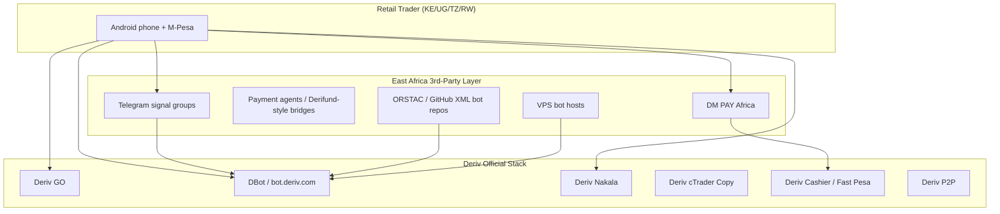

# Product Requirements Document (PRD)

## East Africa Deriv 3rd-Party Trading Platform

**Document version:** 0.3 (Phase E — pre-launch)  
**Target markets:** Kenya, Uganda, Tanzania, Rwanda  
**Stack baseline:** Next.js 16 (App Router), TypeScript, Deriv DerivWS API  
**Status:** MVP + growth features implemented; production deploy + OAuth verification pending

---

## 1. Executive Summary

East Africa has one of the world's highest mobile-money penetration rates and a rapidly growing retail derivatives trading community centered on Deriv synthetic indices (Crash/Boom, Volatility 75/100), forex, and DBot automation. Traders currently stitch together **4–6 disconnected tools**: Deriv GO or MT5 for execution, DM PAY or payment agents for M-Pesa funding, Telegram channels for signals/XML bots, and VPS hosts for uptime.

This platform consolidates **resilient real-time trading**, **localized mobile-money funding**, and **client-side risk controls** into a single Next.js application purpose-built for unreliable 3G/4G networks, USD-denominated accounts with KES/UGX/TZS display, and the security expectations of a FinTech product.

**Primary differentiation:**

| Gap in incumbent tools | Our response |
| --- | --- |
| WebSocket drops on screen lock / tower handoff | Dedicated Web Worker WS engine with reconnect + subscription replay |
| Raw API tokens in `localStorage` | OAuth 2.0 PKCE + server-side OTP exchange; no long-lived tokens in client storage |
| Funding requires leaving the trading UI | Cashier redirect + Payment Agent Directory in-app; STK deferred post-MVP |
| No local-currency PnL context | Live FX conversion layer (KES/UGX/TZS) with configurable display currency |
| Emotional overtrading on synthetics | Hard stop-loss per session + daily max drawdown lockout (client-enforced, server-audited) |

---

## 2. Market & Competitive Audit (Phase 1)

### 2.1 Ecosystem Map

### 2.2 Competitive Evaluation Matrix

| Platform | Type | Strengths | Critical Weaknesses (EA context) | Churn drivers |
| --- | --- | --- | --- | --- |
| **Deriv GO** | Official mobile app | Brand trust, multipliers, KYC integrated | Loading spinners on weak networks; cashier restrictions; no embedded M-Pesa agent flow in-app | "Rotating forever" UI, withdrawal cashier errors |
| **Deriv Nakala** | Official copy-trading (MT5) | Simple copier UX, drawdown stops | MT5-only; requires separate funding; not options/synthetics native | MT5 server mismatch, transfer friction |
| **DBot** | Official web automation | Free, visual builder, XML import | Runs in main thread; dies on tab background/refresh; no mobile-money UX | Lost bot state on disconnect; no offline recovery |
| **DM PAY Africa** | 3rd-party M-Pesa bridge | Instant deposits claim; 50K+ installs | **Not Deriv-affiliated**; balance sync bugs; withdrawal disputes | Post-update deposit failures; funds "held" (Play Store 1–2★ reviews) |
| **Payment agents (Derifund-style)** | Informal bridges | Human support, local trust networks | Manual reconciliation; FX spread opacity; scam risk | Delayed crediting, no transaction audit trail |
| **Telegram + XML bots** | Community signals | Low cost, social proof | Opaque strategies; Martingale-heavy; no risk governance | Account blow-ups, blame attribution to "bad signals" |
| **MT5 + DM PAY** | Common EA stack | Full instrument range | Desktop-centric; WS disconnect on mobile tethering | Execution lag on Boom/Crash spikes |

### 2.3 Payment Landscape by Country

| Country | Primary rail | Deriv official path | Common 3rd-party path | FX pain |
| --- | --- | --- | --- | --- |
| **Kenya** | M-Pesa (Safaricom) | Fast Pesa / Instant Pesa in Cashier (when available) | DM PAY, P2P, agents | KES↔USD rate shown at deposit only; no live PnL in KES |
| **Uganda** | MTN MoMo, Airtel Money | Limited direct integration | DM PAY (claims UG support), agents | UGX conversion often manual/spread-based |
| **Tanzania** | M-Pesa (Vodacom), Tigo Pesa | P2P, agents | DM PAY, local agents | TZS liquidity fragmented across agents |
| **Rwanda** | MTN MoMo | Agents, cards | Informal agents | RWF rarely surfaced in trading UI |

**Strategic implication:** A unified platform cannot legally become an M-Pesa paybill overnight. Phase 1–2 should integrate **Deriv Cashier deep-links** where official rails exist (Kenya) and design an **STK gateway abstraction** that can plug into a licensed payment-agent partner (Phase 3+) without rewriting the trading shell.

### 2.4 Community & Review Signal Summary

**Sources:** Google Play (Deriv GO, DM PAY), Trustpilot (deriv.com), regional blogs (dollarbreak.co.ke, tic.co.tz), Telegram bot communities (ORSTAC, superbinarybots).

| Theme | Frequency | Representative complaint | Product response |
| --- | --- | --- | --- |
| Network instability | High | App "rotating" / trades not placed during spikes | Worker-isolated WS + reconnect state machine |
| Payment delays | High | DM PAY deposit not reflecting; agent holds funds | Idempotent payment ledger + STK query fallback |
| Withdrawal friction | Medium | Cashier restricted; must use same method as deposit | In-app status tracker + guided P2P/agent workflow |
| Security fear | Medium | "Someone hacked my account" (2FA bypass concerns) | PKCE OAuth, httpOnly session cookies, no PAT in client |
| Bot/signal distrust | High | Free XML Martingale bots wipe accounts | Mandatory demo mode + drawdown lockouts |
| FX opacity | Medium | "How much is my profit in shillings?" | Live display-currency layer |

---

## 3. User Personas

### P1 — "M-Pesa Scalper" (Kenya, primary)

- **Profile:** 22–35, Android, trades Boom/Crash and Volatility indices on lunch breaks.
- **Connectivity:** 4G with frequent tower handoffs; screen locks between trades.
- **Funding:** M-Pesa $10–$100 per session via DM PAY or Fast Pesa.
- **Pain:** Missed entries when app reconnects; doesn't know USD loss in KES terms.
- **Success metric:** < 500 ms proposal→buy on V100; zero orphaned open contracts after reconnect.

### P2 — "Signal Follower" (Tanzania/Uganda)

- **Profile:** Imports XML bots from Telegram; low technical literacy.
- **Pain:** Bot stops when browser tab backgrounds; can't tell if bot is running.
- **Success metric:** Visible bot heartbeat; auto-resume after reconnect.

### P3 — "Copy Curious" (Rwanda/Kenya)

- **Profile:** Wants Nakala-like simplicity but on synthetics/options.
- **Pain:** Nakala is MT5-only; wants mobile-first copy with risk caps.
- **Success metric:** Phase 4 copy-trading module (out of MVP scope).

---

## 4. Product Vision & Scope

### 4.1 Vision Statement

> The default trading shell for East African Deriv traders: fast on bad networks, honest about local-money value, and structurally resistant to emotional ruin on synthetic spikes.

### 4.2 MVP Scope (Phase A — see ARCHITECTURE.md §10)

**In scope:**

- OAuth 2.0 PKCE login (Deriv)
- Resilient WebSocket engine (Web Worker)
- Manual + semi-automated trading on top synthetic symbols
- Portfolio / open contract view with reconnect recovery
- Display currency (KES default, configurable UGX/TZS/RWF)
- Client-side daily drawdown lockout + per-trade hard stop
- Deposit initiation UX (Cashier redirect + Payment Agent Directory; no custom Daraja float)
- Demo account parity

**Out of scope (post-MVP):**

- Licensed payment-agent operations (requires regulatory partnership)
- Full copy-trading marketplace
- Native Android APK (PWA first)
- MT5 bridge
- Server-side trade copying

### 4.3 Non-Goals

- Replacing Deriv KYC, compliance, or custody
- Storing user Deriv passwords or API tokens in plaintext
- Guaranteeing profit or selling "signals"
- Operating as an unlicensed payment aggregator

---

## 5. Functional Requirements

### 5.1 Authentication & Account

| ID | Requirement | Priority | Acceptance criteria |
| --- | --- | --- | --- |
| AUTH-01 | OAuth 2.0 Authorization Code + PKCE against Deriv | P0 | No `authorize` token in `localStorage`; session via httpOnly cookie |
| AUTH-02 | Account switcher (demo/real, multi-loginid) | P0 | WS re-auth via fresh OTP per account switch |
| AUTH-03 | Session expiry handling | P0 | Silent refresh where possible; forced re-login on 401 |
| AUTH-04 | Logout clears all client stores | P0 | IndexedDB trading state encrypted-at-rest or wiped |

### 5.2 Trading & Market Data

| ID | Requirement | Priority | Acceptance criteria |
| --- | --- | --- | --- |
| TRD-01 | Subscribe to ticks for selected symbol | P0 | Subscription restored within 2 s of reconnect |
| TRD-02 | Request proposal → buy flow | P0 | Correlated via `req_id`; timeout → user-visible error |
| TRD-03 | Open contract streaming (`proposal_open_contract`) | P0 | Survives tab reload via IndexedDB hydration |
| TRD-04 | Sell / early close | P1 | Idempotent sell requests on retry |
| TRD-05 | Symbol catalog with EA-popular filters | P1 | Crash/Boom, Volatility, Jump indices surfaced |

### 5.3 Automation (MVP-lite)

| ID | Requirement | Priority | Acceptance criteria |
| --- | --- | --- | --- |
| BOT-01 | Rule-based auto-entry (indicator thresholds) | P1 | Runs in Worker; pauses on drawdown lockout |
| BOT-02 | Import DBot-style strategy config (JSON, not XML parser initially) | P2 | Phase B |
| BOT-03 | Bot run/pause/stop with heartbeat UI | P1 | Heartbeat visible; stale > 10 s → warning |

### 5.4 Payments & Wallet UX

| ID | Requirement | Priority | Acceptance criteria |
| --- | --- | --- | --- |
| PAY-01 | Show USD balance + local currency equivalent | P0 | FX rate refreshed ≤ 60 s |
| PAY-02 | Cashier deep-link deposit | P0 | Opens Deriv Cashier with return URL to dashboard |
| PAY-03 | Payment Agent Directory integration | P0 | Lists Deriv-verified agents by country; deep-link or contact |
| PAY-04 | Withdrawal guidance flow | P2 | Step wizard for P2P vs agent vs official Cashier |
| PAY-05 | Custom Daraja STK Push | Deferred | Post-MVP; requires licensed paybill float |

### 5.5 Risk Controls

| ID | Requirement | Priority | Acceptance criteria |
| --- | --- | --- | --- |
| RSK-01 | Per-session hard stop-loss (USD) | P0 | Blocks new buys when session loss ≥ limit |
| RSK-02 | Daily max drawdown lockout | P0 | Persists until next calendar day (EAT timezone) |
| RSK-03 | Max stake cap | P0 | User-configurable; enforced before `buy` |
| RSK-04 | Cooldown after N consecutive losses | P2 | Configurable |
| RSK-05 | Demo-only mode toggle for new strategies | P1 | Cannot enable live until 24 h demo run logged |

### 5.6 Localization & UX

| ID | Requirement | Priority | Acceptance criteria |
| --- | --- | --- | --- |
| LUX-01 | Display currency selector | P0 | KES, UGX, TZS, RWF, USD |
| LUX-02 | Low-bandwidth mode | P1 | Reduce tick UI frequency; compress charts |
| LUX-03 | Connection status banner | P0 | `connected` / `reconnecting` / `degraded` / `offline` |
| LUX-04 | Swahili UI strings (Phase B) | P2 | — |

---

## 6. Non-Functional Requirements

| Category | Target |
| --- | --- |
| **Latency** | Proposal→buy < 300 ms p95 on 4G (excl. network RTT to Deriv) |
| **Reconnect** | Full subscription replay < 3 s after link restore |
| **Availability** | Trading shell usable offline for read-only portfolio view |
| **Security** | OWASP ASVS L2; no secrets in client bundles |
| **Compliance** | Deriv API ToS; local tax disclaimer; not CMA-licensed (disclosed) |
| **Data residency** | AWS `af-south-1` (Cape Town) for backend API, sessions, and future payment metadata |
| **Browser** | Google Chrome (project standard) — see `.cursor/rules/chrome-browser.mdc` |
| **Accessibility** | WCAG 2.1 AA for core trading flows |

---

## 7. Regulatory & Risk Disclosures (Product)

1. **Deriv relationship:** 3rd-party app using public API; not affiliated with Deriv.Com Limited.
2. **Kenya CMA:** Platform is not a licensed broker or CMA-regulated entity; users trade on Deriv's regulated entities.
3. **Payment agents:** MVP uses official Deriv Cashier redirect and Payment Agent Directory; users deal with agents at their own risk (Deriv disclaimer).
4. **Tax:** Kenyan capital gains reporting is user responsibility (30% CGT context — show disclaimer, not advice).
5. **Synthetic indices:** High-risk product; mandatory risk acknowledgement on first live trade.

---

## 8. Success Metrics (12-week post-MVP)

| Metric | Target |
| --- | --- |
| D7 retention | ≥ 35% |
| WS reconnect success rate | ≥ 99% |
| Orphaned contract incidents | < 0.1% of sessions |
| Deposit success rate (STK) | ≥ 95% |
| Median deposit time (STK) | < 90 s |
| Support tickets / DAU | < 5% |
| Drawdown lockout triggers | Track (safety feature, not failure) |

---

## 9. Implementation Phases (Product Rollout)

Detailed technical breakdown lives in `ARCHITECTURE.md` §10. Summary:

| Phase | Name | Duration (est.) | Deliverables |
| --- | --- | --- | --- |
| **0** | Architecture sign-off | ✅ Complete | Decisions locked (see §10) |
| **A** | Core trading shell | 4–6 weeks | Auth, WS Worker, IndexedDB recovery, connection UI |
| **B** | Payments & FX | 3–4 weeks | Cashier + Agent Directory, local currency display |
| **C** | Automation & resilience hardening | 3–4 weeks | Bot runner, IndexedDB recovery, chaos testing on 3G |
| **D** | Growth features | 6+ weeks | Copy trading, Swahili, PWA install, agent dashboard |

---

## 10. Architectural Decisions (Resolved)

| # | Decision | Resolution |
| --- | --- | --- |
| 1 | **Payments (MVP)** | Cashier-only redirect + Payment Agent Directory integration. Defer custom Daraja Paybill float handling to post-MVP. |
| 2 | **API target** | New DerivWS OTP API (`api.derivws.com`) exclusively. OAuth 2.0 PKCE REST auth for WebSocket OTP generation. No legacy `websockets/v3` dual-stack. |
| 3 | **Backend region** | AWS `af-south-1` (Cape Town) for optimal East Africa latency. |
| 4 | **Monetization** | App ID trade markup (0.5%) configured in Deriv Application Manager + affiliate token tracking on OAuth redirects (`affiliate_token`, `utm_campaign`). |

### 10.1 Monetization Implementation

- **Trade markup:** Enable 0.5% markup on the registered Deriv App ID in Application Manager; applied server-side by Deriv on executed trades.
- **Affiliate tracking:** Append `affiliate_token` and `utm_campaign` query params to OAuth authorize URL on every login/signup redirect.
- **No client-side fee logic:** Markup is transparent via Deriv; platform does not intercept trade payloads for fee calculation.

### 10.2 Deferred (Post-MVP)

- Custom Safaricom Daraja STK Push / paybill float
- Copy trading (evaluate Nakala deep-link vs. in-house in Phase D)

---

## 11. Appendix — Primary Pain Point → Feature Traceability

| Pain point (Phase 1 audit) | Root cause (Phase 2) | Feature (Phase 3) |
| --- | --- | --- |
| Connection drops on 3G | Main-thread WS; no reconnect FSM; 2 min idle timeout | Web Worker engine + ping + backoff |
| M-Pesa delays | Agent manual reconciliation | STK Push + idempotent ledger + query fallback |
| No KES PnL | USD-only Deriv balance | FX display layer + session PnL in local currency |
| Slippage on synthetics | Main-thread blocking; serial proposal→buy | Worker pipeline; pre-warmed proposals |
| Token theft | PAT/session token in localStorage | OAuth PKCE + server OTP + httpOnly session |
| State lost on refresh | In-memory React state only | IndexedDB contract mirror + replay on mount |

---

**Next step:** Complete Phase A (auth, WS Worker, IndexedDB recovery), then Phase A.5–A.10 (trade ticket, risk locks, portfolio).
